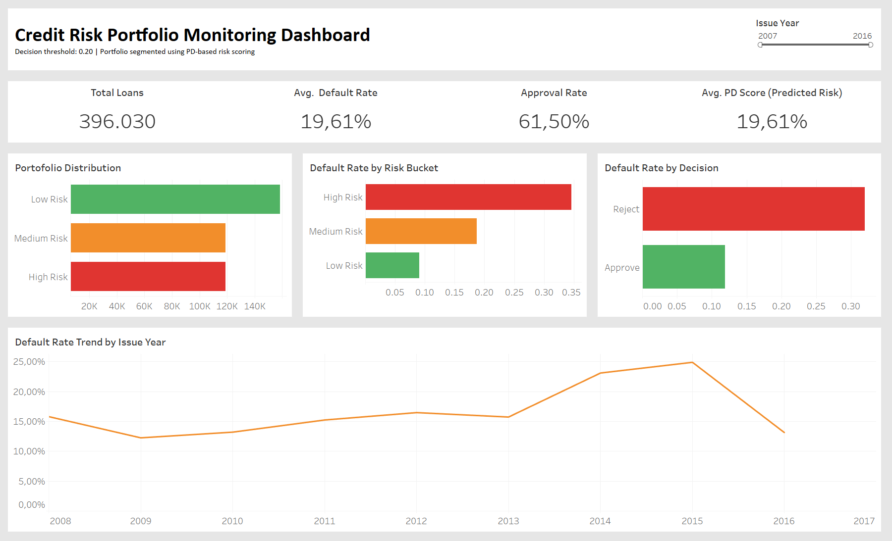
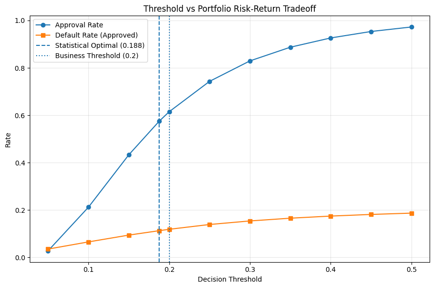
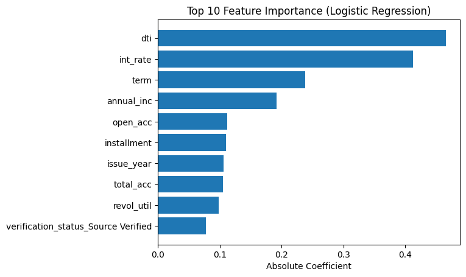

# Credit Risk Portfolio Monitoring

## Project Overview

This project develops an end-to-end Probability of Default (PD) modeling framework for credit portfolio monitoring using supervised machine learning.

By implementing probability-based scoring and threshold optimization, the portfolio average default rate was reduced from approximately 20% to 12%, representing an 8 percentage point improvement in portfolio quality.

The framework simulates a production-style credit risk workflow, covering:

- Data preprocessing and feature engineering  
- Model development and validation  
- PD estimation  
- Threshold optimization  
- Portfolio risk-return tradeoff analysis  
- Model interpretability and governance considerations  

The final production model is a Logistic Regression classifier aligned with traditional banking PD modeling standards.

---

## Business Objective

In credit risk management, model selection must balance:

- Predictive performance (ROC-AUC)  
- Default detection capability (recall)  
- Interpretability and transparency  
- Regulatory compliance  
- Model Risk Management (MRM) standards  

This project emphasizes measurable portfolio impact rather than relying solely on classification accuracy.

---

## Modeling and Validation

### Models Evaluated

- Logistic Regression  
- Random Forest  
- Gradient Boosting  

### Performance Summary

| Model | ROC-AUC | Precision | Recall |
|-------|---------|----------|--------|
| Gradient Boosting | 0.723 | 0.573 | 0.078 |
| Random Forest | 0.721 | 0.641 | 0.025 |
| Logistic Regression | 0.706 | 0.517 | 0.076 |

Although ensemble models achieved slightly higher ROC-AUC, Logistic Regression was selected due to:

- Parametric transparency  
- Coefficient interpretability  
- Auditability  
- Regulatory alignment (Basel-style PD modeling)  
- Lower model risk and validation complexity  

---

## Model Interpretability

The Logistic Regression model provides:

- Coefficient-level transparency  
- Directional impact of risk drivers  
- Odds ratio interpretation  
- Ease of stress testing and sensitivity analysis  

Top default drivers include:

- Debt-to-Income Ratio (DTI)  
- Interest Rate  
- Loan Term  
- Annual Income  
- Revolving Utilization  

These findings align with fundamental credit risk principles where leverage and repayment capacity drive default behavior.

---

## Threshold Optimization and Portfolio Impact

Due to class imbalance, default classification at threshold 0.5 resulted in low recall and limited portfolio control.

A probability-based scoring approach was implemented, followed by threshold tuning to evaluate:

- Approval Rate  
- Default Rate (Approved Segment)  
- Portfolio Exposure  

A business-aligned threshold of 0.20 was selected.

### Portfolio Impact

- Baseline average default rate: ~20%  
- Default rate after threshold optimization: ~12%  
- Risk reduction: ~8 percentage points  

This demonstrates how statistical modeling, when combined with strategic threshold selection, directly improves portfolio quality while maintaining balanced approval rates.

---

## Dashboard Preview

The project includes an interactive portfolio monitoring dashboard designed to simulate a banking credit risk monitoring environment.

The dashboard provides visibility into:

- Probability of Default (PD) distribution  
- Approval rate vs default rate  
- Portfolio segmentation  
- Threshold impact on portfolio exposure  
- Risk concentration across borrower characteristics  

### Portfolio Monitoring Overview

### Threshold Risk-Return Tradeoff

### Key Risk Drivers

---

## Technical Stack

- Python (Pandas, NumPy, Scikit-learn)  
- Logistic Regression (PD modeling)  
- Model Evaluation (ROC-AUC, Precision, Recall)  
- SQL (schema design, feature engineering, monitoring views)  
- Tableau (portfolio dashboard)  
- Joblib (model persistence)  

---

## Keywords

- Probability of Default (PD)  
- Credit Risk Modeling  
- Basel-aligned modeling approach  
- Model Risk Management (MRM)  
- Threshold Optimization  
- Portfolio Monitoring  
- Regulatory Transparency  
- Risk Segmentation  
- Scorecard-style modeling  
- Portfolio Risk-Return Tradeoff  

---

## Author

Mario Suryowisnu Wicaksono  
Data Analyst | Tech Enthusiast

**LinkedIn:** *www.linkedin.com/in/marioswicaksono*

**CV:** *[marioswicaksono](https://www.canva.com/design/DAGlhKwckaQ/vjIw_6NJgrAEq4hVCdpEUw/view?utm_content=DAGlhKwckaQ&utm_campaign=designshare&utm_medium=link2&utm_source=uniquelinks&utlId=h9dd2c26e9d)*

**Portfolio:** *[marioswicaksono](https://marioswicaksono.my.canva.site/)*